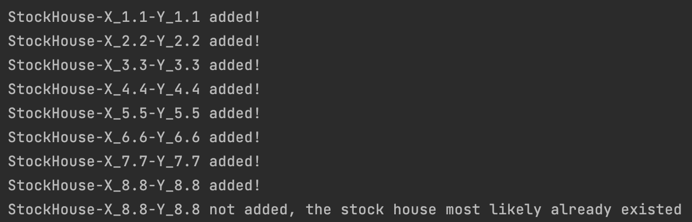
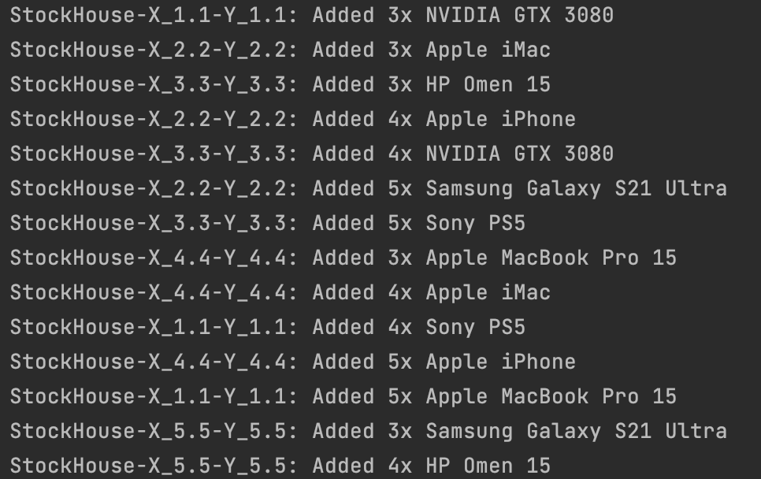
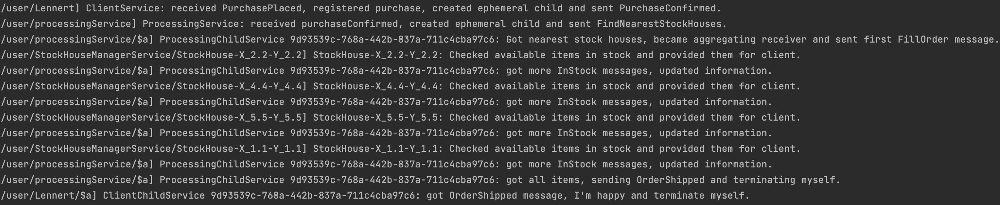
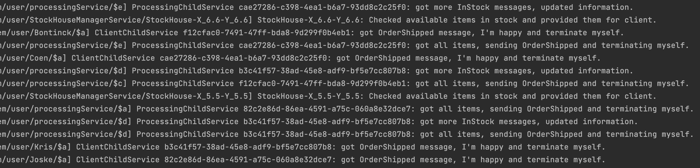
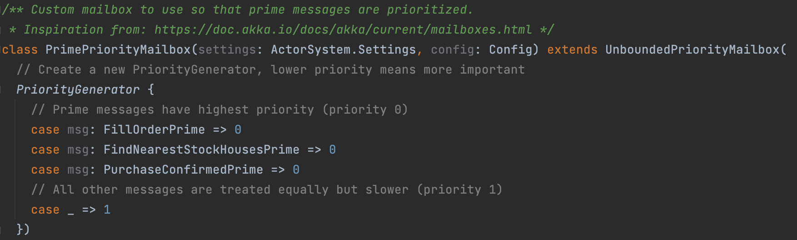

# Assignment 3 of Software Architecture course

This is the GitHub repository for the third and last assignment of the Software Architecture course @ VUB 2020-2021. This assignment was made in the second examination period.

## Table of contents

> - [Student info](#student-info)
> - [Important files and folders](#important-files-and-folders)
> - [Notes on the code](#notes-on-the-code)
> - [Running the code](#running-the-code)
> - [Validated output](#validated-output)

## Student info
- **Name**: Bontinck Lennert
- **Email**: lennert.bontinck@vub.be
- **StudentID**: 568702
- **Affiliation**: VUB - Master Computer Science: AI

## Important files and folders
- [Assignment PDF](assignment.pdf)
- [Report containing explanation on solution of the assignment](Lennert-Bontinck-SA2.pdf)
- [Written code folder](code/)

## Notes on the code

- The code has been developed on macOS Big Sur by using the IntelliJ IDEA 2021.1.3 Ultimate Edition and the "Scala" plugin by JetBrains.
- It was validated to work on a Windows 10 machine as well using the same software.
- For this project, the following version of base software are used (same as WPOs)
  - JRE and JDK 1.8.291
  - sbt 1.3.13
- The sbt build will provide the required dependencies which are the same as the one from the last exercise session (11).

## Running the code

- Open the build.sbt file available under code\Lennert-Bontinck-SA3\build.sbt with the IntelliJ IDEA.
- Select Open as Project and select Trust Project.
- The IntelliJ IDEA should build the build.sbt file providing the dependencies. If all base software was installed with the same versions as used for this assignment, it should provide the correct SDKs as well.
- Rightclick on ```main```under ```src/main/scala/Lennert_Bontinck_SA3```, and select ```run Main```. The main file will now run which will process some requests.
- NOTES:
  - Some artificial pauses have been added to the code (sleeping threads) to demonstrate functionality. 
  - The code doesn't terminate as some actors stay online to receive further potential messages, manual termination is required (as was also the case in WPO sessions)

## Validated output

Note that in the main file you can specify which flow you would like to see by changing the provided Boolean variables.

### Add stock houses

It is possible to add stock houses by message, which will store the actorref in the processingService, as a named actor object. It is checked that no identical stock house is added (stock house on same address). See below, note naming includes address, which is represented by an x and y point! See the output below in the first "paused" block of logging from the main loop.

The seperation between business logic and communication logic, as specified by the domain-object pattern, is clear here, the service does keep a list of actorref's but the business logic object keeps the actual stock houses.



### Add products

It is possible through messages to add products to a warehouse. Again, there is clear seperation of communication and business logic. See output of the second "paused" blcok of logging from the main loop.



### Succesfull order processing: OrderShipped

In the final block of the main loop logging, multiple purchases are performed. In the screenshot below, a fullfilable order is shown. This clearly demonstrates the flow of the application.

This output is achieved by using displayOnlyASingleOrderShippedProcess = true.



### Succesfull order processing: OrderDelayed

In the final block of the main loop logging, multiple purchases are performed. In the screenshot below, a non fullfilable order is shown. This clearly demonstrates the flow of the application to contact all stock houses and then fail to fullfill order since all stock houses (5 closest) are asked to fulfill order and there is a list of items remaining to be fulfilled.

This output is achieved by using displayOnlyASingleOrderDelayedProcess = true.


### Succesfull order processing: OrderShipped for many order

Below is the output of running the code for 7 orders of which some contain 5+ differing products, all work as expected, see that multiple actors finish in a non synchronic order.

This output is achieved by using displayAll = true.



### Prioritize prime clients

Since the processing of messages is blazing fast on a new system with such small actors, there is no real time for the mailbox to get filled with messages. However, due to adding an artificial wait (sleeping thread) on some strategic places we can see the custom mailbox working in prioritzing messages from prime clients. Note that only some prime client messages should be prioritized, i.e. those that are in a mailbox where also requests from non prime members may be collected.



